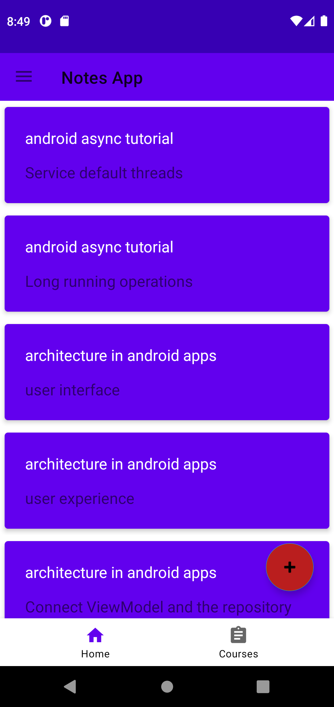
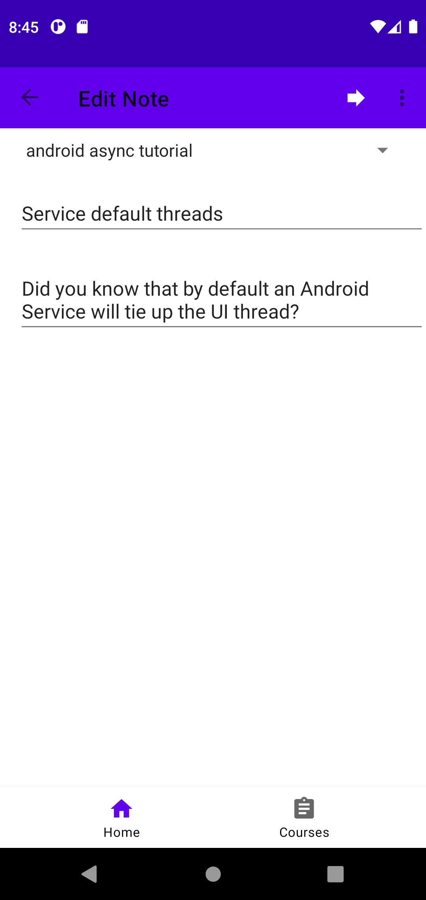
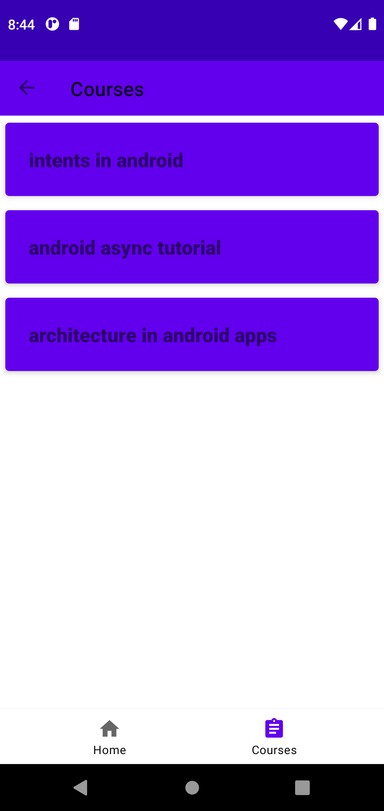
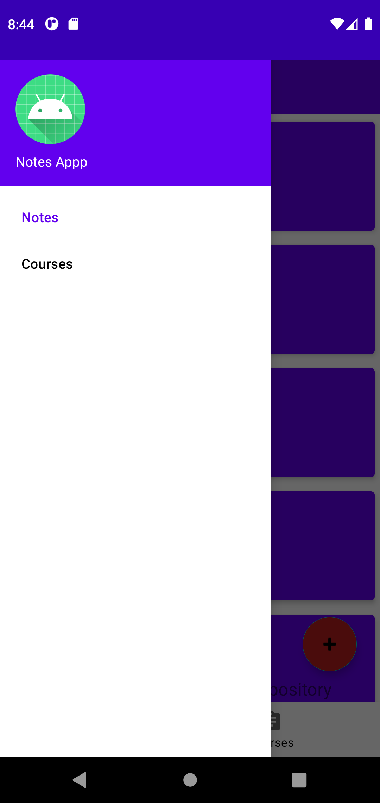

# NoteApp
This is an android app developed as part of the learning journey in the GADS2021 Scholarship.

I developed the app by following Jim Wilson's kotlin android series on Pluralsight.

Although the app is developed as part of the series, this app was adpated to the new android technologies not used by Jim wilson in his courses.
These include:
 - Fragments
 - Navigation component
 - Architecture components

The app also uses the latest (at the time of developement) android studio arctic fox version 2020.3.1

List of Notes                                           |  Edit notes              
:----------------------------------------------------:|:-------------------------:
  |  

List of Courses                                          |  Navigation drawer screen
:----------------------------------------------------:|:-------------------------:
  |  

